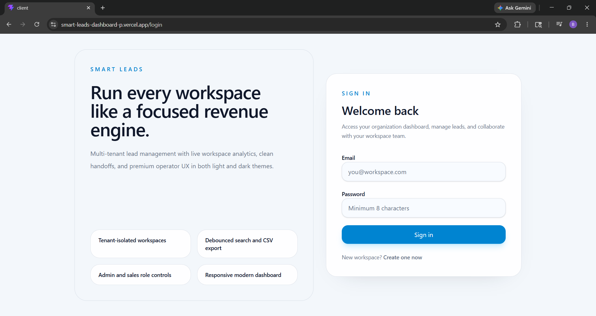
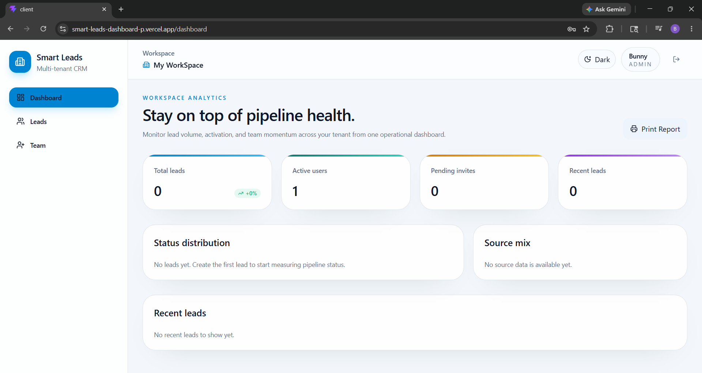
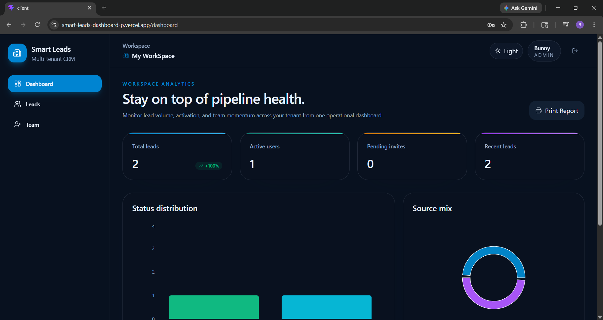
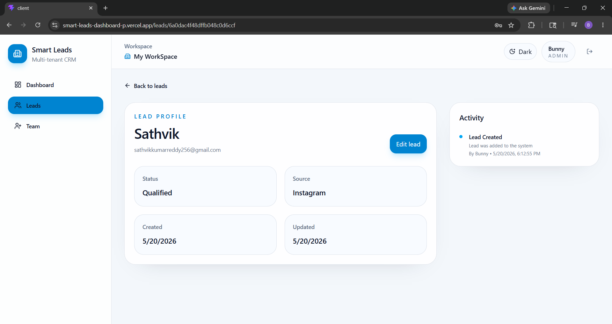
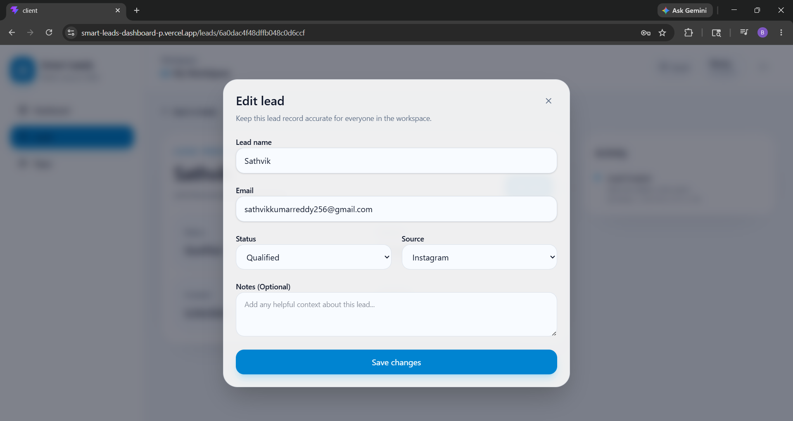

# Smart Leads Dashboard

A modern multi-tenant CRM dashboard built using the MERN stack.  
This application helps teams manage leads, track pipeline activity, monitor analytics, and collaborate within isolated workspaces.

---

# Live Demo

### Frontend
https://smart-leads-dashboard-p.vercel.app/

### Backend API
https://smart-leads-dashboard-e8fu.onrender.com

---

# GitHub Repository

https://github.com/Pranav-Reddy29/smart-leads-dashboard

---

# Features

- Multi-tenant workspace architecture
- JWT Authentication & Authorization
- Workspace-based lead management
- Dashboard analytics
- Lead CRUD operations
- Team management
- Dark / Light theme support
- Protected routes
- Responsive modern UI
- RESTful API architecture
- MongoDB Atlas integration
- Deployment on Vercel + Render

---

# Tech Stack

## Frontend
- React.js
- TypeScript
- Vite
- Tailwind CSS
- React Router
- Axios
- Zustand

## Backend
- Node.js
- Express.js
- TypeScript
- MongoDB
- Mongoose
- JWT Authentication

## Deployment
- Vercel (Frontend)
- Render (Backend)
- MongoDB Atlas (Database)

---

# Screenshots

## Login Page



---

## Dashboard Analytics



---

## Dark Mode Dashboard



---

## Lead Details



---

## Edit Lead Modal



---

# Project Structure

```bash
smart-leads-dashboard/
│
├── client/                 # Frontend Application
│   ├── src/
│   ├── public/
│   └── package.json
│
├── server/                 # Backend Application
│   ├── src/
│   ├── dist/
│   └── package.json
│
├── README-assets/
│   ├── login.png
│   ├── dashboard.png
│   ├── dark-mode.png
│   ├── lead-details.png
│   └── edit-lead.png
│
├── README.md
├── .gitignore
└── docker-compose.yml
```

---

# API Documentation

## Authentication Routes

### Register Workspace Admin

```http
POST /api/auth/register
```

### Login

```http
POST /api/auth/login
```

---

## Lead Routes

### Get All Leads

```http
GET /api/leads
```

### Create Lead

```http
POST /api/leads
```

### Update Lead

```http
PUT /api/leads/:id
```

### Delete Lead

```http
DELETE /api/leads/:id
```

---

## Dashboard Routes

### Get Dashboard Analytics

```http
GET /api/dashboard
```

---

# Environment Variables

## Backend `.env`

```env
PORT=5000
NODE_ENV=development

MONGO_URI=your_mongodb_connection_string

JWT_SECRET=your_jwt_secret
TOKEN_EXPIRES_IN=7d

CLIENT_URL=http://localhost:5173

SMTP_HOST=smtp.example.com
SMTP_PORT=587
SMTP_USER=your_smtp_user
SMTP_PASS=your_smtp_password
SMTP_SECURE=false

SMTP_FROM_EMAIL=no-reply@example.com
SMTP_FROM_NAME=Smart Leads
```

---

## Frontend `.env`

```env
VITE_API_URL=http://localhost:5000/api
```

---

# Setup Instructions

## Clone Repository

```bash
git clone https://github.com/Pranav-Reddy29/smart-leads-dashboard.git
```

---

# Frontend Setup

```bash
cd client
npm install
npm run dev
```

Frontend runs on:

```bash
http://localhost:5173
```

---

# Backend Setup

```bash
cd server
npm install
npm run dev
```

Backend runs on:

```bash
http://localhost:5000
```

---

# Build Commands

## Frontend

```bash
npm run build
```

## Backend

```bash
npm run build
```

---

# Deployment

## Frontend Deployment
- Hosted on Vercel

## Backend Deployment
- Hosted on Render

## Database
- MongoDB Atlas

---

# Authentication

The application uses JWT-based authentication.

Features:
- Secure login/signup
- Token-based authorization
- Protected routes
- Workspace isolation

---

# Future Improvements

- Role-based access control
- Email notifications
- Activity logs
- CSV import/export
- Advanced filtering
- Real-time updates
- Team invitations

---

# Author

## Pranav Kumar Reddy

- GitHub: https://github.com/Pranav-Reddy29
- LinkedIn: https://in.linkedin.com/in/baddampranavkumarreddy

---

# License

This project is developed for internship assessment purposes.
